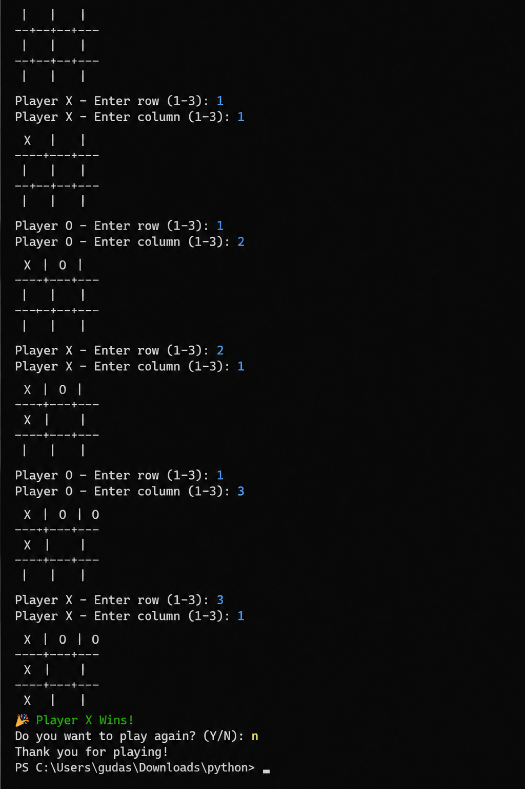

# Tic Tac Toe Game

## Objective
Develop a two-player Tic Tac Toe game in Python.

## Features
- 3×3 game board
- Two-player gameplay (X and O)
- Win detection
- Tie detection
- Play Again option

## Technologies Used
- Python 3

## How to Run
1. Download the project.
2. Open a terminal.
3. Run:
   python main.py

   
