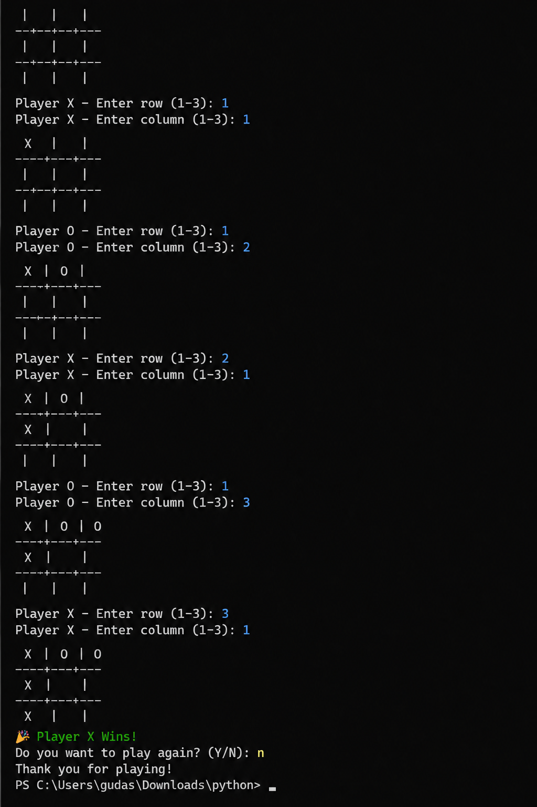

# 🎮 Tic-Tac-Toe Game

## 📌 Description
This project is a simple Tic-Tac-Toe game developed in Python. It is a two-player console application where players take turns placing their symbols (X and O) on a 3×3 grid. The game automatically checks for a winner or a draw after every move and displays the final result.

## ✨ Features
- Two-player gameplay
- 3×3 game board
- Input validation for player moves
- Automatic winner detection
- Draw detection
- Easy-to-understand Python code

## 🛠️ Technologies Used
- Python 3

## 📂 Project Structure
```
TASK-1-Tic-Tac-Toe/
│── main.py
│── tic_tac_toe.py
│── output1.png
│── README.md
```

## ▶️ How to Run

1. Clone the repository:
```bash
git clone https://github.com/your-username/your-repository.git
```

2. Navigate to the project folder:
```bash
cd TASK-1-Tic-Tac-Toe
```

3. Run the game:
```bash
python main.py
```

## 📸 Output



## 🎯 Learning Outcomes
- Python programming fundamentals
- Conditional statements and loops
- Functions and modular programming
- User input handling
- Game logic implementation

## 📜 License
This project is created for learning and educational purposes.
