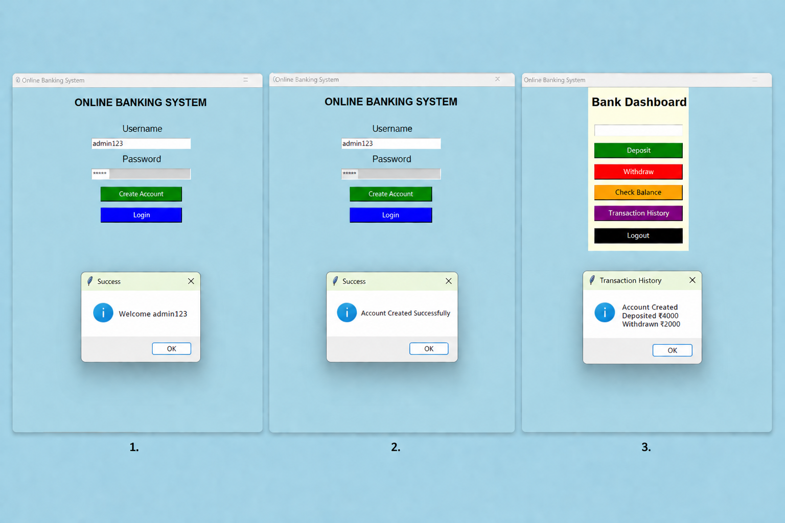

# TASK-2: Online Banking System (GUI)

## Description
This project is a GUI-based Online Banking System developed using Python and Tkinter.

## Features
- User Login
- Create New Account
- Deposit Money
- Withdraw Money
- Check Balance
- Transaction History
- Error Handling

## Technologies Used
- Python
- Tkinter

- 

