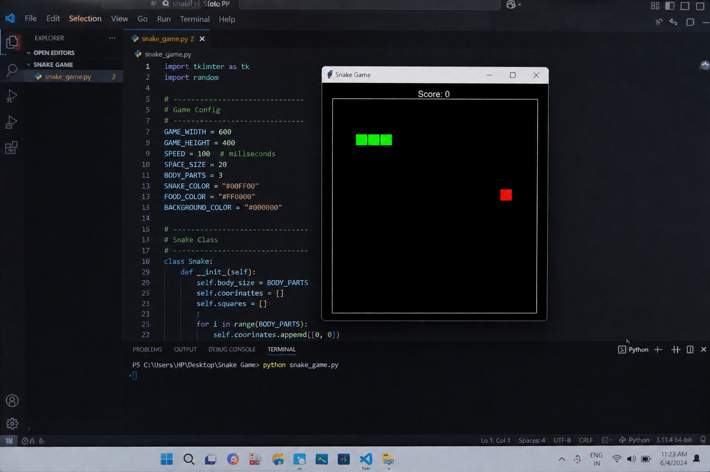

# 🐍 Snake Game using Python & Tkinter

A simple Snake Game built with **Python** and **Tkinter**. Control the snake, eat food, increase your score, and avoid hitting the walls or yourself.

---

## 📌 Features

- 🎮 Classic Snake Game
- 🍎 Random food generation
- 📈 Live score display
- 🚧 Wall collision detection
- 🐍 Self-collision detection
- ❌ Game Over screen
- ⌨️ Keyboard controls

---

## 🛠️ Technologies Used

- Python 3.x
- Tkinter (GUI)
- Random Module
- ## 🎮 Controls

| Key | Action |
|------|--------|
| ↑ | Move Up |
| ↓ | Move Down |
| ← | Move Left |
| → | Move Right |
## 🚀 Future Improvements

- Pause and Resume
- Restart Button
- High Score System
- Sound Effects
- Different Difficulty Level
- ## Output

## Author
Guda Sarada Reddy

